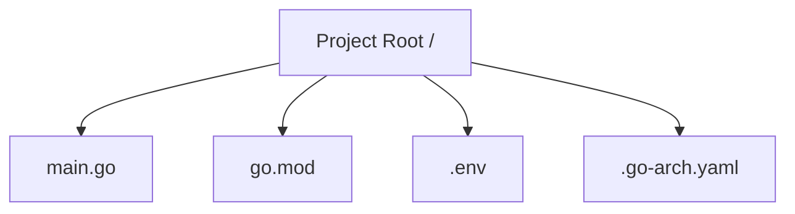
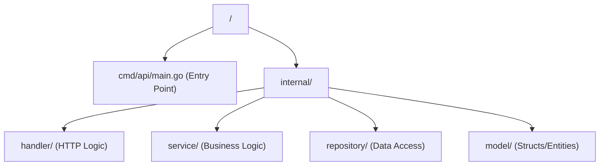
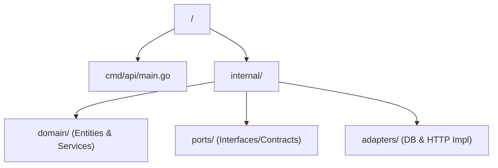
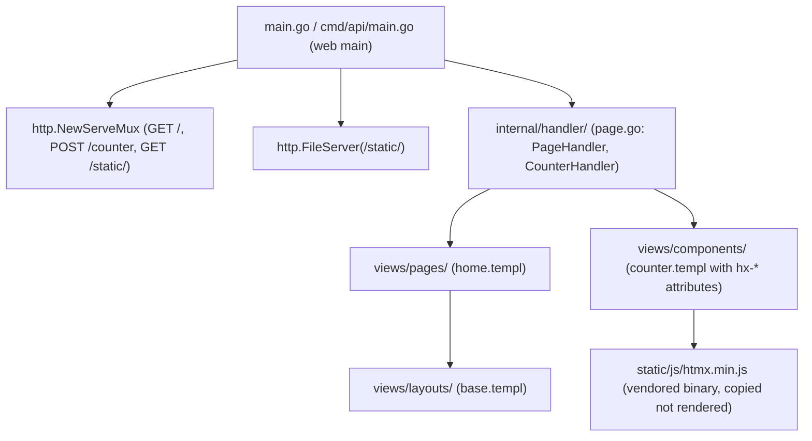

# Project Architecture & Layouts 🏛️

This document provides a deep dive into the architectural principles and folder structures supported by **Go-Arch**. It also explains how the internal "External Templates" engine works.

---

## 📐 Supported Project Layouts

The CLI standardizes projects into three distinct patterns, ranging from minimal logic to enterprise-grade decoupling.

### 1. Minimalist Layout ⚡
Best for microservices, lambda functions, or single-source tools where over-engineering is a risk.
- **Goal**: Speed and simplicity.
- **Structure**:

### 2. Standard Layout 📦
A conventional Go structure following common community practices (Package-oriented design).
- **Goal**: Clarity and separation of concerns for mid-sized apps.
- **Structure**:

### 3. Hexagonal Architecture (Ports & Adapters) ⬢
Our premium enterprise-grade layout. It isolates the domain logic from external concerns.
- **Goal**: High testability and independence from frameworks/databases.
- **Structure**:

---

## 🎨 Deep Customization (External Templates)

One of the most powerful features of `go-arch` is the ability to **override the default code generation** without modifying the CLI binary.

### How the "Lookup" Engine works
When you run a command like `generate crud`, the CLI searches for templates in a hierarchical order of precedence:

1.  **Local Project**: `.go-arch/templates/` inside your project.
2.  **Global User**: `~/.go-arch/templates/` in your Home directory.
3.  **Installed Packs**: `~/.go-arch/packs/<name>@<version>/templates/` (when `new --template` is used; see `template install`).
4.  **Embedded**: Built-in defaults inside the binary.

### Available Template Helpers
When creating custom templates, you can use these built-in functions to manipulate strings and data:
- `now`: Returns current timestamp.
- `lower`: Converts string to lowercase.
- `upper`: Converts string to uppercase.
- `plural`: **Smart pluralization** (e.g., `Category` -> `Categories`, `User` -> `Users`).

**Usage**: `{{ .EntityName | lower | plural }}`

### Example: Customizing the Handler
If you want all your project handlers to use a specific framework (e.g., Gin instead of net/http), you can create:
`~/.go-arch/templates/common/handler.tmpl`

The CLI will automatically detect it and use your version instead of the default one.

---

## 🛡️ Living Architecture (Validation Rules)
The `go-arch check` command enforces strict dependency rules to prevent architectural decay.

### Hexagonal Rules ⬢
- **Domain (Core)**: MUST NOT import anything from `internal/ports` or `internal/adapters`. The business logic must be pure and independent.
- **Ports (Contracts)**: MUST NOT import `internal/adapters`. Interfaces should not depend on their implementations.

### Standard Rules 📦
- **Model**: Must be self-contained; no imports from other `internal/` packages are allowed.
- **Repository**: MUST NOT import `service` or `handler` to avoid circular dependencies and ensure a one-way data flow.

---

## 🔭 Observability & Telemetry
In 2026, observability is a first-class citizen. `go-arch` implements **OpenTelemetry (OTel)** by default when enabled.

### Implementation Pattern
- **SDK Initialization**: Located in `internal/telemetry/telemetry.go`. It sets up the TracerProvider and Propagators.
- **Agnostic Exporting**: The CLI uses the **OTLP (OpenTelemetry Line Protocol)** over HTTP. This means the Go code is decoupled from the backend; you can switch from Jaeger to SigNoz just by changing the endpoint.
- **Auto-Tracing Middleware**: A pre-configured HTTP middleware (`internal/telemetry/middleware.go`) traces every incoming request, capturing path, method, and duration automatically.

---

## 🛰️ Microservices & gRPC
For high-performance inter-service communication, `go-arch` follows the **Contract-First** approach.

### Implementation Pattern
- **Protobuf Contracts**: All services are defined in `api/proto/service.proto`.
- **Dual-Stack Server**: The generated `main.go` initializes both HTTP and gRPC servers. This allows services to expose a REST API for clients and a gRPC API for internal communication.
- **Automated Tooling**: A **Makefile** is provided to handle the complexity of `protoc` compilation. Running `make proto` will automatically generate the Go bindings in `internal/adapters/grpc/proto`.

---

## 🐚 Infrastructure & Docker

If **Docker Support** is enabled during the `new` command, the CLI generates:
- **Dockerfile**: Multi-stage build for a minimal production image.
- **docker-compose.yaml**: Orchestration for the app and the selected database.

---

## 🌐 Server-Rendered Frontend (templ + HTMX)

When the **templ + HTMX frontend** option is enabled during `go-arch new`, the generated project becomes full-stack — the frontend lives inside the same Go binary (no SPA, no Node, no bundler).

### Generated Structure

### How It Works
- **Views**: `*.templ` files (templ language) compile to pure Go via `templ generate`. The engine's `//go:embed all:templates/*` embeds them; the scaffold writes `views/{layouts,pages,components}/`.
- **Interactivity**: HTMX attributes (`hx-post`, `hx-target`, `hx-swap`) make the browser send AJAX requests declared in HTML — no custom JS. The server returns HTML fragments; HTMX swaps them without a page reload.
- **State**: Lives on the server (e.g. a `sync.Mutex`-guarded counter in the handler), never duplicated client-side.
- **Web main**: When the frontend is enabled, `web/main.tmpl` replaces the architecture main — it registers the mux, static file serving, and the conditional telemetry/gRPC blocks. Minimalist writes to root `main.go`; Standard/Hexagonal to `cmd/api/main.go`.
- **Binary asset**: `htmx.min.js` is copied byte-for-byte via `TemplatesFS.ReadFile` + `os.WriteFile` — never passed through the text/template engine (it would choke on `{{ }}`).

### Frontend Generation
`go-arch generate page <Name>` and `go-arch generate component <Name>` create templ views in `views/pages/` and `views/components/`, gated on `use_templ_htmx: true` in `.go-arch.yaml`, with CamelCase name validation and collision detection.

---

## 🏭 Production-Ready Scaffolding (scaffold-prod v1)

Every project generated since `scaffold_prod_v1` ships three production-oriented pieces:

### Typed Config (`internal/config/`)
- `config.Load()` reads `SERVER_PORT` (default `8080`), `APP_ENV` (default `development`), and `DATABASE_URL` from the environment.
- With a database driver selected, `Load()` **fails fast** when `DATABASE_URL` is missing, pointing to `.env.example`.
- stdlib only — no viper in the generated project.

### Subcommand Main
Generated mains dispatch on `os.Args[1]` (stdlib switch):
- no argument / `server` — runs the HTTP server (preserves the Dockerfile `CMD ["./main"]`)
- `migrate` — applies pending database migrations (relational projects only)
- `version` — prints a version string
- unknown — prints usage and exits `2`

### Migrations Runner (`internal/dbmigrate/`)
- Generated for PostgreSQL and MySQL projects (not MongoDB, not DB-less).
- SQL migrations are embedded via `//go:embed migrations/*.sql` and applied in filename order inside transactions.
- `schema_migrations` tracks applied versions — re-running is idempotent.
- The runner pins the driver (`pgx/v5` for PostgreSQL, `go-sql-driver/mysql` for MySQL) in `go.mod`.

### Upgrade Injection
The `scaffold_prod_v1: true` marker in `.go-arch.yaml` gates upgrade behavior: projects that lose their `internal/config` or `internal/dbmigrate` packages get them re-injected during `go-arch upgrade` so the re-rendered main compiles. Projects without the marker keep their legacy mains untouched.

---

## 🛠️ Internal CLI Architecture

The CLI itself is built following the **Screaming Architecture** pattern:
- **`cmd/`**: Cobra commands (`new`, `generate`, `check`, `serve`, `setup`, `mcp`, `version`).
- **`internal/ui/`**: Styled output helpers and the interactive survey wizard.
- **`internal/pkg/template/`**: The "Lookup" Engine and embedded blueprints (including the `web/` templates for templ + HTMX).
- **`internal/pkg/scaffold/`**: The orchestrator that maps metadata to file creation (and the `web` scaffold for the frontend).
- **`internal/pkg/validator/`**: Architectural rule validation used by `go-arch check`.
- **`internal/pkg/mcp/`**: The MCP server exposing CLI commands as tools over stdio.
